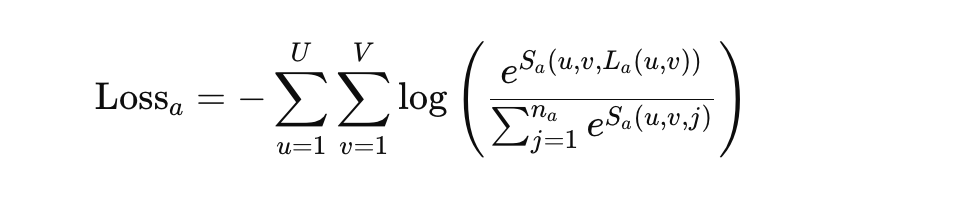
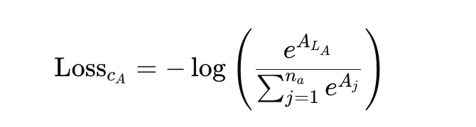

# 任务定义与系统框
## 参考文献

- [ChemGrapher: Optical Graph Recognition of
Chemical Compounds by Deep Learning](https://arxiv.org/pdf/2002.09914)

## 🧪 一、任务定义（Problem Statement）

本研究的目标是从一张二维化学结构图像中自动识别出分子的完整图结构。

- **输入**：2D 化学结构图像 `x`（黑白或灰度图）
- **输出**：图结构 `G = (V, E)`，其中：
  - `V`：节点集合（原子，含位置 + 类型 + 电荷）
  - `E`：边集合（化学键，含连接关系 + 类型）

我们要训练一个映射函数：


其中 `G` 是最终的图结构。

---

## 🧠 二、总体技术思路

ChemGrapher 将识别任务拆分为两个阶段：

### ✅ 阶段一：图像分割（Segmentation）

输入图像 `x` → 输出 3 个分割张量：

- `S_a`：原子分割图
- `S_b`：键分割图
- `S_c`：电荷分割图

形式上，分割网络实现如下函数：


---

### ✅ 阶段二：区域分类（Classification）

对第一阶段提取的候选区域，使用三个分类网络分别识别：

- `c_A(S_acut, x_acut, h_aL) → A`：预测原子类型  
- `c_B(S_bcut, x_bcut, h_bL) → B`：预测键类型  
- `c_C(S_ccut, x_ccut, h_cL) → C`：预测电荷类型

这些函数形式如下所示：

  
  


---

### 🔄 阶段三：图结构构建（Graph Building）

利用预测出的原子、键信息构建最终的图结构：


---

## ⚙️ 模块结构图总览

| 模块 | 输入 | 功能 | 输出 |
|------|------|------|------|
| 分割网络 `s(x)` | 图像 `x` | 像素级分割 | `S_a`, `S_b`, `S_c` |
| 分类网络 `c_A, c_B, c_C` | 候选区域 | 区域分类 | `A`, `B`, `C` |
| 图构建器 | 分类结果 + 候选位置 | 构建图结构 | `G = (V, E)` |

---

# 分割网络（Segmentation Network）

## 🧠 模块目标

分割网络的任务是将输入图像 `x` 映射为三个张量，每个张量为一个多通道图像，分别表示：

- 每个像素属于哪种原子类型
- 哪种化学键类型
- 是否具有电荷以及电荷类型

该网络学习的映射形式为：


---

## 📐 输出定义

- `S_a ∈ ℝ^{U×V×n_a}`：原子类型分割图
- `S_b ∈ ℝ^{U×V×n_b}`：键类型分割图
- `S_c ∈ ℝ^{U×V×n_c}`：电荷分割图

其中：
- `U×V`：图像大小；
- `n_a, n_b, n_c`：对应原子、键、电荷的所有可能类型数目（包含空类）

---

## 🧾 标签格式

每张训练图像具有三个像素级标签矩阵：

- `L_a ∈ I^{U×V}_{n_a}`：原子标签  
- `L_b ∈ I^{U×V}_{n_b}`：键标签  
- `L_c ∈ I^{U×V}_{n_c}`：电荷标签  

这些标签定义了每个像素属于哪一类。

---

## 📉 损失函数（Cross Entropy）

对每个像素位置 \((u, v)\)，进行 softmax 分类。

以原子预测为例，像素的交叉熵损失为：



其中：
- `S_a(u,v,j)` 是第 `j` 类在位置 `(u,v)` 的得分；
- `L_a(u,v)` 是该像素的真实类别索引。

---

同理，键和电荷的损失定义为：

  


---

### 🔗 总损失函数为三者之和：


---

## 🧱 网络结构（来自 Table 1）

| 层名 | 卷积核 | 激活 | Padding | Dilation |
|------|--------|------|---------|----------|
| conv1 | 3×3 | ReLU | 1 | 无 |
| conv2 | 3×3 | ReLU | 2 | 2 |
| conv3 | 3×3 | ReLU | 4 | 4 |
| conv4 | 3×3 | ReLU | 8 | 8 |
| conv5 | 3×3 | ReLU | 8 | 8 |
| conv6 | 3×3 | ReLU | 4 | 4 |
| conv7 | 3×3 | ReLU | 2 | 2 |
| conv8 | 3×3 | ReLU | 1 | 无 |
| last | 1×1 | None | 无 | 无 |

---

## ✅ 模块小结

- 使用空洞卷积提升感受野，同时保留图像分辨率；
- 输出为三个多通道张量 `S_a, S_b, S_c`；
- 每个像素通过 softmax 分类；
- 训练使用加权交叉熵损失，支持不均衡类别学习；
- 模块输出为后续分类网络提供候选区域。

# 分类网络

## 🎯 模块目标

该部分包括三个分类网络：
- `c_A`：识别原子类型
- `c_B`：识别化学键类型
- `c_C`：识别电荷类型

每个网络都使用：
- 局部裁剪的图像区域（来自分割网络输出）
- 原图裁剪片段
- 高亮图 `h`（指示候选位置）

---

## ✅ 1. 原子分类网络（c_A）

### 🔢 输入

- `S_acut ∈ ℝ^{K×L×n_a}`：分割输出裁剪区域
- `x_acut ∈ ℝ^{K×L}`：原图裁剪
- `h_aL ∈ ℝ^{K×L}`：候选位置高亮图

### 🔚 输出

预测向量 `A ∈ ℝ^{n_a}`：每类原子的得分（包含空类）

### 📉 损失函数：



---

## ✅ 2. 键分类网络（c_B）

### 🔢 输入

- `S_bcut, x_bcut, h_bL`：同上，输入两个端点的位置高亮区域

### 🔚 输出

预测向量 `B ∈ ℝ^{n_b}`：每类键的得分（含空类）

### 📉 损失函数：


---

## ✅ 3. 电荷分类网络（c_C）

### 🔢 输入

- `S_ccut, x_ccut, h_cL`：单点区域裁剪 + 高亮图

### 🔚 输出

预测向量 `C ∈ ℝ^{n_c}`：每类电荷的得分（含空类）

### 📉 损失函数：


---

## 🧱 分类网络结构（来自 Table 2）

| 层名 | 卷积核 | 激活 | Padding | Dilation |
|------|--------|------|---------|----------|
| depthconv1 | 3×3 | ReLU | 1 | 无 |
| conv2 | 3×3 | ReLU | 2 | 2 |
| conv3 | 3×3 | ReLU | 4 | 4 |
| conv4 | 3×3 | ReLU | 8 | 8 |
| conv5 | 3×3 | ReLU | 1 | 无 |
| maxpool | 124×124 | 无 | 无 | 无 |
| last | 1×1 | None | 无 | 无 |

---

## ✅ 小结

- 分类器接受局部图像区域作为输入；
- 候选位置由高亮图明确指出；
- 分类器能够容错弥补分割误差，是图结构准确性的核心；
- 网络结构高效、感受野大、推理快速。

# 图结构构建算法

## 🧱 模块目标

前面的分割和分类模块预测了所有的原子、键和电荷信息。现在需要将这些信息组合成最终的分子图结构：


其中：
- `V` 是节点集合（原子 + 电荷 + 位置）
- `E` 是边集合（键 + 类型 + 连接对）

---

## 🔁 算法流程（简要伪代码）

```python
Input: 图像 x
Output: 分子图 G = (V, E)

S_a, S_b, S_c = s(x)
atomCandidates = generateAtomCandidates(S_a)

V = []
for atomCand in atomCandidates:
    S_acut, x_acut, h_aL = cutAtomCand(atomCand, S_a, x)
    S_ccut, x_ccut, h_cL = cutAtomCand(atomCand, S_c, x)
    A = c_A(S_acut, x_acut, h_aL)
    C = c_C(S_ccut, x_ccut, h_cL)
    if A is not empty:
        V.append((atomCand, A, C))

bondCandidates = generateBondCandidates(V)
E = []
for bondCand in bondCandidates:
    S_bcut, x_bcut, h_bL = cutBondCand(bondCand, S_b, x)
    B = c_B(S_bcut, x_bcut, h_bL)
    if B is not empty:
        E.append((bondCand, B))
```
## 🧠 技术细节

### 🧬 节点构建（V）

1. 从 `S_a` 中生成原子候选位置；
2. 对每个候选区域：
   - 使用 `c_A` 进行原子类型分类；
   - 使用 `c_C` 进行电荷类型分类；
3. 如果预测为非空类别（非背景），则将 `(位置, 原子类型, 电荷)` 加入节点集合 `V`。

### 🔗 边构建（E）

1. 在节点集合 `V` 中，枚举所有距离小于 2 倍键长的原子对作为候选；
2. 对每个候选原子对裁剪图像片段并构建 `S_bcut, x_bcut, h_bL`；
3. 使用 `c_B` 分类其键类型；
4. 若预测为有效键类型，则加入边集合 `E`。

---

## 🔍 高亮图引导分类器

候选原子或键在构建输入时，都会生成一个 **highlight 图 `h`**。  
它以掩码的形式突出当前候选点或边的位置，引导分类器聚焦判断目标。

这种机制对分割结果有误差的情况，具备良好的容错能力。

---

## ✅ 小结

- 图结构的生成依赖于：候选区域 + 局部分类器输出；
- 分类器是关键，负责容错与细化识别；
- 距离约束、分割掩码、分类器三者结合，使得预测图结构既完整又语义清晰。

# 实验与结果

## 📋 验证数据集

- **分割网络验证集**：12,000 个分子（图像 + 标签）
- **分类网络验证集**：450 个分子，生成：
  - 27,000 个原子候选点（用于原子和电荷预测）
  - 55,000 个键候选对（用于键分类）

---

## 📈 1. 分割 vs 分类网络性能对比

使用 F1 分数（调和平均）评估各任务表现。

- 分割网络：精度受类别频率影响显著，稀有类别识别效果差；
- 分类网络：显著优于分割网络，能够容错修正前一阶段错误；

> 分类网络准确性对最终图结构有关键影响，任何准确率下降都会迅速累积误差。

---

## 📊 2. 图结构准确率评估

### 🔬 测试设置

使用 3 种图像风格（字体、线粗、图形风格不同）生成测试图像：

- 每种风格测试 2 种情况：
  - 不含立体化学信息（无楔形/虚线）
  - 含立体化学信息（楔形、虚线键等）

共构成 6 个测试集，每组包含 1000 张图像。

### 🧪 评估标准：

只要预测的结构图中有 **1 个错误（原子、键或电荷）** 即视为整体预测错误。

### 🆚 对比对象：OSRA（传统 OCR 工具）

### 📉 实验结果：


ChemGrapher 在所有 6 个测试集中错误率 **均低于 OSRA**，在含立体化学信息的图像中优势更显著。

---

## 📚 3. 案例研究：科研文章图像中的表现

从真实 PDF 文献中裁剪出 61 张结构图像：

| 工具 | 正确预测数 | 总数 |
|------|--------------|------|
| ChemGrapher | 46 | 61 |
| OSRA         | 42 | 61 |

### 👀 额外观察：

- ChemGrapher 在识别“仅含碳原子”的图像中效果更好（图像中无文字）；
- 图像中出现粗线时，ChemGrapher 会产生误判，作为未来改进重点。

---

## ✅ 小结

| 模块 | 指标 | 结果 |
|------|------|------|
| 分割网络 | F1 分数 | 中等，依赖样本分布 |
| 分类网络 | F1 分数 | 高，容错能力强 |
| 整体图预测 | 准确率 | 明显优于 OSRA |
| 真实图测试 | 应用精度 | ChemGrapher 更鲁棒 |

ChemGrapher 是一个性能稳定、模块协同、实用性强的结构图识别系统，尤其适用于多种风格的化学图像处理场景。
# ChemGrapher 论文速读 Part 6：结论与未来工作

## ✅ 总结结论

ChemGrapher 是一个将 2D 化学结构图像转化为完整图结构的端到端系统，其主要优点包括：

- **完全数据驱动**：不依赖手写规则或 OCR 技术；
- **高准确率**：分类模块对图结构预测有关键保障；
- **模块组合紧凑**：分割 + 分类 + 构图，高度模块化；
- **结构可解释**：每个图节点和边都可定位到图像上的具体区域；
- **支持多种图像风格**：在立体化学信息和无文字标注图像中表现优越；
- **优于 OSRA**：无论在合成图还是真实文献图中表现均显著更好。

此外，研究中还开发了：
- 自动合成像素级标注数据集（基于 RDKit）；
- 多通道语义分割网络 + 三分类器架构；
- 候选生成机制 + 高亮图输入，提升分类准确性。

---

## 🔭 未来工作方向

当前系统的一个限制是：
- **训练数据依赖像素级标注**，而这类数据集很少，主要靠 RDKit 合成生成；
- 在真实图像中，系统表现虽然优越，但受限于图像风格偏移。

因此，未来工作目标是：

### ✅ 引入弱监督学习（Weakly Supervised Learning）

- 放弃像素级标签，改为使用“图结构是否正确”作为训练信号；
- 更容易使用真实图像进行训练；
- 提升模型对多样化图像风格的适应性；
- 降低数据准备成本；
- 推动系统从结构识别向真实场景应用更进一步。

---


